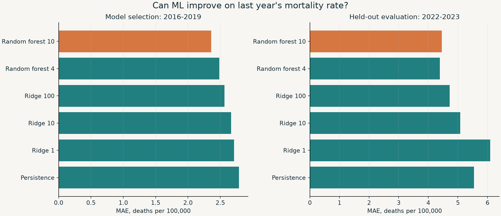

# HealthValue Atlas

**Экономика здравоохранения: расходы, результаты лечения и прогноз смертности.**

[Открыть приложение](https://morenoler.github.io/healthvalue-atlas/) · [Аналитический отчёт](reports/ANALYSIS_RU.md) · [Методология](docs/METHODOLOGY.md) · [Данные и источники](docs/DATA.md)

Проект отвечает на два вопроса. Как расходы на здравоохранение связаны со смертностью, которую можно снизить своевременным лечением? Можно ли улучшить прогноз на следующий год с помощью экономических и демографических данных?

В основе проекта лежат 46 стран и 14 лет наблюдений. Полная сетка содержит 644 пары «страна - год». Для 614 пар есть показатель смертности. Исходные ответы API, код анализа и результаты входят в репозиторий.

## Главные результаты

- В срезе за 2023 год участвуют 36 стран. Корреляция Спирмена между расходами и смертностью равна **-0,80**.
- После учёта эффектов стран и лет связь заметно слабее. Рост расходов на 10% связан с изменением смертности на **-0,15%**. 95% доверительный интервал: **от -2,42% до +2,18%**. Эти данные не дают точной оценки направления связи внутри страны.
- Медиана изменения смертности за 2010-2023 годы равна **-20,6%**. В расчёт входят только 36 стран с данными за обе даты.
- По временной валидации выбран **Random Forest с минимальным листом 10**. MAE на тесте за 2022-2023 годы равна **4,46 смерти на 100 000**. У прогноза по прошлому году MAE равна **5,54**. Снижение ошибки составляет **19,6%**.
- Фактическое покрытие интервала прогноза равно **98,7%** при номинальном уровне 90%. Полуширина интервала составляет **20,81**. Калибровка на пандемийных годах дала широкий интервал, поэтому высокое покрытие само по себе не означает точный прогноз.

Связь между расходами и смертностью не доказывает причинный эффект бюджета. Подробный разбор есть в [отчёте](reports/ANALYSIS_RU.md).

## Что можно сделать в приложении

- Выбрать страну, год и одну из трёх категорий смертности.
- Сравнить расходы и исходы в одном году.
- Открыть карту и переключить цвет между расходами и смертностью.
- Посмотреть динамику и пять ближайших стран по доходу и возрастной структуре.
- Сравнить пять эконометрических спецификаций.
- Изменить расходы в сценарном калькуляторе и увидеть неопределённость оценки.
- Проверить качество моделей на будущих годах.
- Посмотреть пропуски и скачать итоговую таблицу.

Приложение работает как статический сайт. Для него не нужны API-ключи или внешний сервер. Локальный FastAPI дополнительно даёт доступ к данным и сценариям через API.

## Аналитическая работа

**Подготовка данных.** Загрузка из официальных API, снимок исходных ответов, контроль SHA-256, единицы измерения, уникальные ключи и проверка пропусков. Для времени используется прокси расходов в постоянных ценах. Текущие доллары по ППС остаются в сравнении стран одного года.

**Эконометрика.** Панельная регрессия с эффектами стран и лет. Стандартные ошибки учитывают зависимость наблюдений внутри страны. Дополнительные проверки: период до 2020 года, группа высокого дохода и линейные тренды стран.

**Machine Learning.** Ridge, Random Forest и прогноз по прошлому году. Модели предсказывают годовое изменение показателя. Заполнение пропусков, масштабирование и кодирование стран входят в sklearn Pipeline.

**Проверка на будущих годах.** Валидация: 2016-2019. Финальное обучение: до 2019 года. Калибровка интервалов: 2020-2021. Тест: 2022-2023. Выбор модели зависит только от валидации. Разница ошибок проверена бутстрэпом по странам.



## Запуск

### Без установки

Откройте файл **HealthValue Atlas.html** в браузере двойным щелчком. На Windows также можно запустить **Open Atlas.cmd**. Внутри HTML уже есть данные, карта и весь интерфейс. Интернет, Python и локальный сервер не нужны. Все разделы, фильтры и выгрузка CSV работают автономно.

Если GitHub Pages не открывается в вашей сети, используйте этот файл из копии репозитория. Обычный `web/index.html` требует HTTP-сервер.

### С локальным API

Рекомендуемая версия Python: **3.13**. Команды выполняются из корня репозитория.

```bash
python -m venv .venv
```

В Windows PowerShell активируйте окружение:

```powershell
.venv\Scripts\Activate.ps1
```

В Linux и macOS:

```bash
source .venv/bin/activate
```

Установите зависимости и запустите приложение:

```bash
python -m pip install -r requirements.txt
python -m pip install -e .
python -m healthvalue serve
```

Приложение: `http://127.0.0.1:8000`. Документация API: `http://127.0.0.1:8000/docs`.

Для просмотра готового сайта достаточно стандартного Python:

```bash
cd web
python -m http.server 8080
```

Откройте `http://127.0.0.1:8080`. Этот режим показывает готовый исследовательский срез. Он не запускает обучение и FastAPI.

## Воспроизведение исследования

Все исходные данные уже есть в репозитории. После установки библиотек пересчёт не требует сети:

```bash
python -m healthvalue build
python -m pytest -q
```

Команда создаёт таблицу по странам и годам, SQLite-базу, оценки моделей, метрики, графики, отчёт и данные для приложения. Сборка проверяет контрольные суммы источников перед расчётом.

Чтобы получить новую версию исходных рядов, выполните:

```bash
python -m healthvalue collect
python -m healthvalue build
```

Обновление заменит локальный снимок источников и может изменить результаты. Период исследования останется 2010-2023. Новую версию стоит сохранить отдельным коммитом.

## Структура

```text
src/healthvalue/    загрузка, подготовка, модели, отчёт и API
data/raw/          исходные ответы API и манифест
data/processed/    итоговая таблица
sql/               представления и исследовательские запросы
reports/           выводы, коэффициенты, прогнозы и графики
docs/              источники и методология
web/               интерактивное приложение
tests/             проверки данных, временных разбиений и API
.github/workflows/ сборка исследования и публикация приложения
```

`data/atlas.sqlite` создаётся при сборке и не хранится в Git. SQL-примеры лежат в `sql/research.sql`.

## API

- `GET /api/health`: состояние приложения.
- `GET /api/countries`: страны выборки.
- `GET /api/panel?year=2023&iso3=POL`: наблюдение или срез.
- `GET /api/models`: коэффициенты и метрики.
- `GET /api/scenario?change_pct=10`: связь изменения расходов с исходом и доверительный интервал коэффициента.

Docker запускает API и готовое приложение:

```bash
docker build -t healthvalue-atlas .
docker run -p 8000:8000 healthvalue-atlas
```

## Проверки качества

Тесты проверяют контрольные суммы, дубликаты, диапазоны показателей, лаги через пропуски лет, обучение преобразований только на тренировочных данных, независимость выбора модели от теста, порядок границ интервала и API. GitHub Actions пересчитывает исследование из исходного снимка и запускает тесты.

Браузерная проверка охватывает фильтры, выбор страны на графике, сценарии, поиск и мобильный вид. Детали: [VALIDATION.md](docs/VALIDATION.md).

## Источники данных

- [OECD Health Statistics](https://www.oecd.org/en/data/datasets/oecd-health-statistics.html): смертность, которую можно снизить лечением или профилактикой.
- [WHO Global Health Expenditure Database](https://apps.who.int/nha/database/): расходы и структура финансирования. Получены через World Bank WDI.
- [World Bank World Development Indicators](https://data.worldbank.org/): ВВП, население, возрастная структура и урбанизация.
- [Natural Earth](https://www.naturalearthdata.com/): географические границы для карты, масштаб 1:110 млн.

Снимок загружен **4 октября 2026 года**. Коды рядов, определения, URL и преобразования описаны в [DATA.md](docs/DATA.md).

## Ограничения

Выборку задаёт доступность данных ОЭСР. Она не представляет весь мир. Страновые показатели не описывают отдельного пациента или больницу. Прогноз использует текущую версию исторических данных и предполагает доступность прошлогодних показателей. Фактические задержки публикаций не моделируются. Сценарий показывает статистическую связь и не служит оценкой эффекта реформы.

## Стек

Python, pandas, NumPy, SciPy, statsmodels, scikit-learn, Matplotlib, SQLite, FastAPI, pytest, JavaScript, SVG, GitHub Actions и GitHub Pages.
